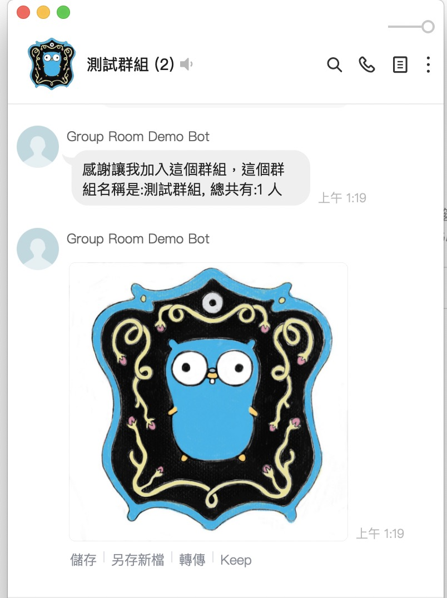
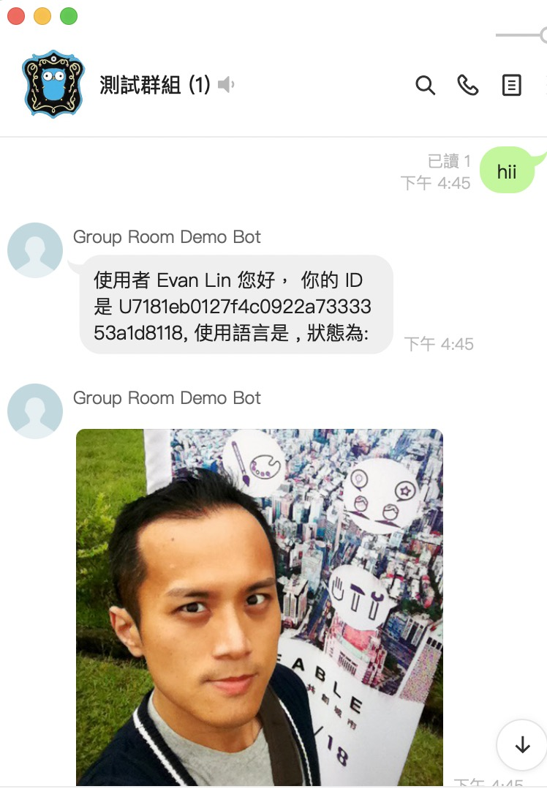
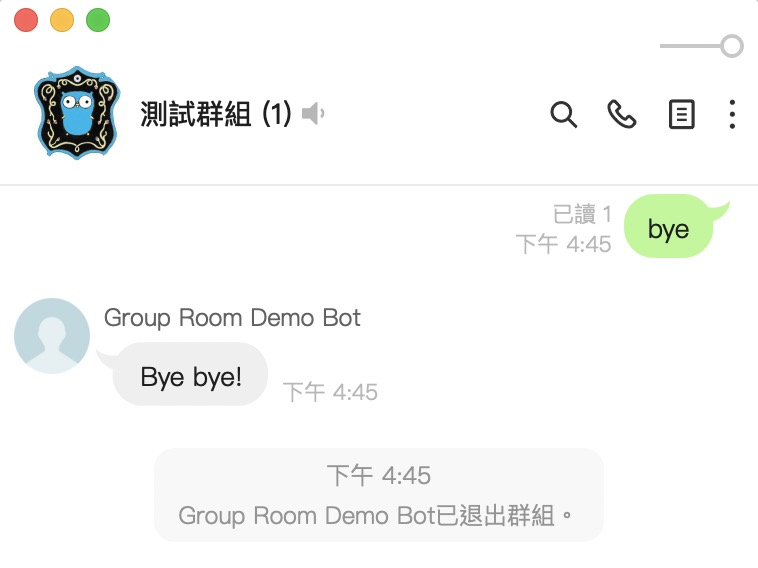

# LINE Group demo bot: A LINE Chatbot to demo LINE group features by Golang

   

For LINE Group Event API, please check:

- [https://developers.line.biz/en/news/2020/06/10/messaging-api-update-june-2020/](https://developers.line.biz/en/news/2020/06/10/messaging-api-update-june-2020/)

# How to use it

### Get Group Profile

1. Scan this QR code add LINE Friend.

2. Invite this chatbot into any group.

3. It will show your group name and group image.

### Get Group/Room user profile 

1. Type any word in group/room.
2. It will show group/room user profile.

### Leave Group/Room

1. Type "bye".
2. Chatbot will leave a group/room.

# Installation and Usage

More detail, please check my [LINE Bot Template project](https://github.com/kkdai/LineBotTemplate).

License
---------------

Licensed under the Apache License, Version 2.0 (the "License");
you may not use this file except in compliance with the License.
You may obtain a copy of the License at

http://www.apache.org/licenses/LICENSE-2.0

Unless required by applicable law or agreed to in writing, software
distributed under the License is distributed on an "AS IS" BASIS,
WITHOUT WARRANTIES OR CONDITIONS OF ANY KIND, either express or implied.
See the License for the specific language governing permissions and
limitations under the License.

